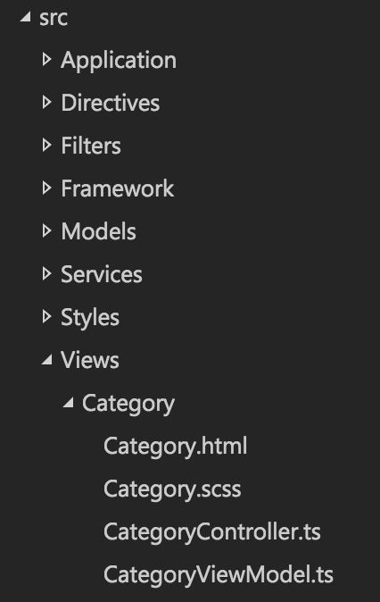

# Overview

The starter project comes with a suggested starting point for a framework. Its features will be covered in this section.

It is important to note that this starter project is not actually a framework. See [Framework vs. Starter Project](index.md#framework-vs-starter-project) for the distinction between the two.

The base namespace used is `JustinCredible.SampleApp`. To switch this to your own namespace, you can perform a project find and replace.

# Build Schemes

The project is set up so that builds can be made for different environments. This is useful for easily switching between development, staging, or production environments, for example.

You can switch between build schemes using the `gulp config --scheme scheme_name` command.

See [Development Tips: Build Schemes](development-tips.md#build-schemes) for more details.

# Boot Sequence

Cordova uses the the `src` attribute of the content element from `config.xml` to determine the initial page to load. This is set to `index.html` by default.

The `index.html` file has static references to all of the CSS and JavaScript files to load. In addition to the main application bundle (`www/js/bundle.js`), the page also references the first-level boot loader: `www/js/boot1.js`. This file is responsible for executing any code before Cordova's JS API, Ionic, or Angular have been initialized. It then kicks off the second-level boot loader by invoking `JustinCredible.SampleApp.Boot2.main()`.

The second-level boot loader is located at `src/Framework/Boot2.ts` (which is compiled into `www/js/bundle.js`). The second-level boot loader is responsible for initializing Ionic after the Cordova JavaScript ready event occurs. This is where you would configure Angular services and modules.

The second-level boot loader automatically registers filters, directives, controllers, and services using a helper (`src/Framework/BootHelper.ts`). It does this by examining the applicable namespaces (e.g., `JustinCredible.SampleApp.Filters`, `JustinCredible.SampleApp.Services`, etc.). More details are provided in the applicable sections. The second-level boot loader also takes care of setting up the Angular routes using the `src/Application/RouteConfig.ts` file.

After initializing and configuring Angular, the second level boot loader then delegates to the `start()` method of the application service located in `src/Application/Application.ts`.

The application service is where the bulk of your low-level application-specific code should be located (i.e., device events, global event handlers, push notification handlers, etc.). It takes care of pushing the user to the initial view.

# Views

A view or screen in your application will consist of an HTML Angular template, an Angular controller, a view model, and optionally, CSS styling.

A view is registered in the `src/Application/RouteConfig.ts` file by specifying the path to its template, the ID of its controller, and its URL and state name:

```
// A shared view used between categories, assigned a number via the route URL (categoryNumber).
$stateProvider.state("app.category", {
    url: "/category/:categoryNumber",
    views: {
        "root-view": {
            templateUrl: "Views/Category/Category.html",
            controller: Controllers.CategoryController.ID
        }
    }
});
```

In most simple Angular examples, you'll find that templates, controllers, and view models are often located in separate directories. While this is nice for a simple application, in larger applications it is a burden to track down each of the files. To avoid this, this starter project groups the files by feature rather than function.

For example, you'll find all of the files applicable to the category view located at `src/Views/Category`:



## Controllers

Every controller in your application should extend the provided `BaseController` class and specify the type of view model for the view:

```
namespace JustinCredible.SampleApp.Controllers {

    export class CategoryController extends BaseController<ViewModels.CategoryViewModel> {

        //#region Injection

        public static ID = "CategoryController";

        public static get $inject(): string[] {
            return [
                "$scope",
                "$stateParams"
                Services.Utilities.ID
            ];
        }

        constructor(
            $scope: ng.IScope,
            private $stateParams: ICategoryStateParams,
            private Utilities: Services.Utilities) {
            super($scope, ViewModels.CategoryViewModel);
        }

        //#endregion

        //#region BaseController Events

        protected view_beforeEnter(event?: ng.IAngularEvent, eventArgs?: Ionic.IViewEventArguments): void {
            super.view_beforeEnter(event, eventArgs);

            // Set the category number into the view model using the value as provided
            // in the view route (via the $stateParameters).
            let label = this.Utilities.format("Category: {0}", this.$stateParams.categoryNumber);
            this.viewModel.categoryLabel = label;
        }

        //#endregion
    }
}

```    

!!! note
	If your view does not have a view model, you can use the provided `EmptyViewModel` class.

The services to be injected into the controller are controlled via the static `$inject` property. These IDs are used to locate the services to be injected into the constructor.

The constructor receives these parameters and can save off the services to the local instance. TypeScript allows the `private` keyword in the constructor to indicate that the parameters should be accessible as private instance variables.

Finally, the base events avaiable from the `BaseController` can be overridden. These include several events exposed by Ionic:

* `view_loaded`
* `view_enter`
* `view_leave`
* `view_beforeEnter`
* `view_beforeLeave`
* `view_afterEnter`
* `view_afterLeave`
* `view_unloaded`
* `destroy`

## View Model

The specified view model is accessible in the template via the `viewModel` property:

```
<ion-view view-title="Category {{viewModel.categoryNumber}}">
```

## View Events

To access an event on your controller, you should make your event `protected`:

```
protected button1_click(event: ng.IAngularEvent): void {
   ...
}
```

and access it using the `controller` property:

```
<button ng-click="controller.button1_click($event)">Click Me!</button>
```

# Directives

Angular directives are located in the `src/Directives` directory. There are two types of directives in this starter project: standard and element instance.

## Standard Directive

A standard directive is simply a class that has a link function.

An example of a standard directive can be found in `src/Directives/OnLoadDirective.ts`. This directive can be used by placing an `on-load` attribute on an image element, and will cause a function to be fired when the image has loaded. For example:

```

```

## Element Instance Directive

The optional `BaseElementDirective` class provides a recommendation on how to build element directives. This base class provides `initialize` and `render` methods that should be overridden in your implementation.

This base class is useful for building element directives that need to maintain state, fire events, or otherwise act as accessible instances from your controller.

An example directive that can be used to show an icon with text is located at `/src/Directives/Icon-Panel/IconPanelDirective.ts`, and is used from the category controller.

# Filters

Angular filters are located in the `src/Filters` directory. To be registered as a filter automatically, a class should exist in the `JustinCredible.SampleApp.Filters` namespace, and it should contain a unique static ID property and a single static function named `filter`.

```
namespace JustinCredible.SampleApp.Filters {

    export class ThousandsFilter {

        public static ID = "Thousands";

        public static filter(input: number): string {
           ...
        }
    }
}    
```

# Services

Angular services are located in the `src/Services` directory. To be registered as a service automatically, a class should exist in the `JustinCredible.SampleApps.Service` namespace and contain a unique static ID property.

```
namespace JustinCredible.SampleApp.Services {

    /**
     * Provides a common set of helper/utility methods.
     */
    export class Utilities {

        //#region Injection

        public static ID = "Utilities";

        public static get $inject(): string[] {
            return [
                MyService.ID,
                Preferences.ID
            ];
        }

        constructor(
            private MyService: MyService,
            private Preferences: Preferences) {
        }

        //#endregion

        public someMethod(): void {
		     this.MyService.doSomething();
        }
    }
}    
```

!!! note
	If the class contains a static `getFactory` method, it will be registered as a factory instead of a service.

## Provided Services

The following services are provided with this sample project.

### Configuration

Contains configuration values, including a reference to the build variables from the `www/js/build-vars.js` file.

### FileUtilities

A set of helper methods for working with Cordova's file plugin.

### HttpInterceptor

A special factory for intercepting all HTTP requests. It is responsible for showing a progress indicator (via the [NProgress](http://ricostacruz.com/nprogress/) library) for asynchronous requests or a full-screen spinner for blocking requests.

It also takes care of expanding URLs starting with a tilde, defining the URL by prepending `config.xml`'s `ApiUrl` property to it (e.g., `~/Products/123` would be expanded to `http://your-server.com/path/Products/123`).

It is also responsible for adding headers (such as API keys) or otherwise modifying requests before they go out.

### Logger

Used to handle logging requests of various levels (e.g., `info`, `warn`, `error`, etc.).

The provided implementation delegates to the applicable `console` methods and stores logs in memory (which can be viewed via the [in-app developer tools](base-framework.md#developer-tools)), but a production implementation could send logs to your servers.

### MockHttpApis

Used to provide mock implementations for HTTP request data. This is useful for demos, development, or testing.

Mock API mode is enabled via the developer tools view.

See [Development Tips: Mock HTTP APIs](development-tips.md#mock-http-apis) for more details.

### MockPlatformApis

Used to provide mock implementations of APIs that are native to certain platforms. This allows you to mock up Cordova plugin APIs that may not be available in the browser during development.

This is mainly used by the plugins service.

See [Development Tips: Mock Platform APIs](development-tips.md#mock-platform-apis) for more details.

### Plugins

Used as a facade to access native Cordova plugins. If a plugin is not available on the given platform, it will delegate to `MockPlatFormApis` to obtain a mock implementation.

### Preferences

Used to store user preferences that should persist when the application has closed. The default backing store is the web view's local storage (which is sandboxed and specific to your application instance).

### UiHelper

Contains several helper methods for user interface-related tasks. These include alert, confirm, and prompt dialogs as well as a PIN dialog.

It also includes a generic API to show your own custom dialogs.

See [Dialogs](base-framework.md#dialogs) for more information.

### Utilities

Contains several helper methods for string manipulation, determining device information, type introspection, and more.

# PIN Entry

The sample project includes a PIN entry dialog that the user can enable via the Settings view.

If the application is in the background for more than ten minutes, the user-specified PIN must be entered to use it.

# Developer Tools

In a debug build, the in-app developer tools view will be accessible from the Settings view. In a non-debug build, the tools can be enabled by tapping the application icon in the About view ten times.

This view is a good location for items that are used during development. By default, it allows the user to toggle mock HTTP mode, test various plugins, view logs logged by the Logger service, and view device information.

# Dialogs

Ionic provides the `$ionicModal` service, which can be used to show modal dialogs. This sample project includes the `BaseDialogController` base class and a `UiHelper` method `showDialog()`, which are used to simplify usage and normalize dialog behavior.

Two example dialogs are included with this sample project, located at `src/Views/Dialogs`.

The `showDialog` method wraps Ionic's modal implementation. It should be invoked with the ID of the controller for the dialog and optional dialog options. It returns a promise that is resolved once the dialog has been closed.

```
this.UiHelper.showDialog(PinEntryController.ID, options)
	.then((result: Models.PinEntryDialogResultModel) => {

	// Dialog closed with result object.
});
```

To create a dialog, you first need to create a template with the modal class and the `ng-controller` attribute to specify the ID of your dialog's controller:

```
<div class="modal" ng-controller="PinEntryController">
```

Then you'll need to create a controller that extends `BaseDialogController`. If you examine the base class, you'll see that it requires three templated types:

```
export class BaseDialogController<V, D, R> extends BaseController<V> { ... }
```

* `V` - view model that will be used in the dialog's template and controller.
* `D` - dialog model that is passed into the dialog via the options parameters when opening the dialog.
* `R` - dialog result model that is used to return information from the dialog to the caller promise when the dialog is closed.

For example, the PIN entry dialog works with `PinEntryViewModel` (`V`). It receives `PinEntryDialogModel` as its input (`D`), and when it closes it returns `PinEntryDialogResultModel` (`R`):

```
export class PinEntryController
	extends BaseDialogController<ViewModels.PinEntryViewModel, Models.PinEntryDialogModel, Models.PinEntryDialogResultModel> {
	...
}	
```

!!! note
	Each of these types is optional, and not all dialogs require all three types. For any types you do not wish to specify, you can pass `any` or `ViewModels.EmptyViewModel`.

If you examine the sample dialogs, you'll see that the base class provides two events that are fired when the dialog opens and closes (`dialog_shown` and `dialog_hidden`, respectively).

There are are two base helper methods provided. The first, `getData()`, is used to obtain the model object used to open the dialog (templated type `D`). The second, `close()`, is used to close the dialog. You can optionally pass an object of type `R` to the close method, which will be returned to the opener via the promise result.

# Popovers

Although this starter project does not contain a specific base class for Ionic's popover view, you can see an example of one's use on Develper Tools > Logs view.

A popover is generally initialized via the `view_beforeEnter` event by specifying the path to an HTML template and the scope to use (which can be the same scope as the current controller). The popover can later be shown by invoking its `show()` method:

```
protected view_beforeEnter(event?: ng.IAngularEvent, eventArgs?: Ionic.IViewEventArguments): void {
    super.view_beforeEnter(event, eventArgs);

    this.$ionicPopover.fromTemplateUrl("Views/Settings/Logs-List/Log-Filter-Menu.html", {
        scope: this.scope
    }).then((popover: any) => {
        this._popover = popover;
    });
}

protected filter_click(event: ng.IAngularEvent) {
    this._popover.show(event);
}
```

If the popover shares the same scope, the view model and controller can be accessed in the same way as a [standard controller](base-framework.md#controllers) using the `viewModel` and `controller` keywords.