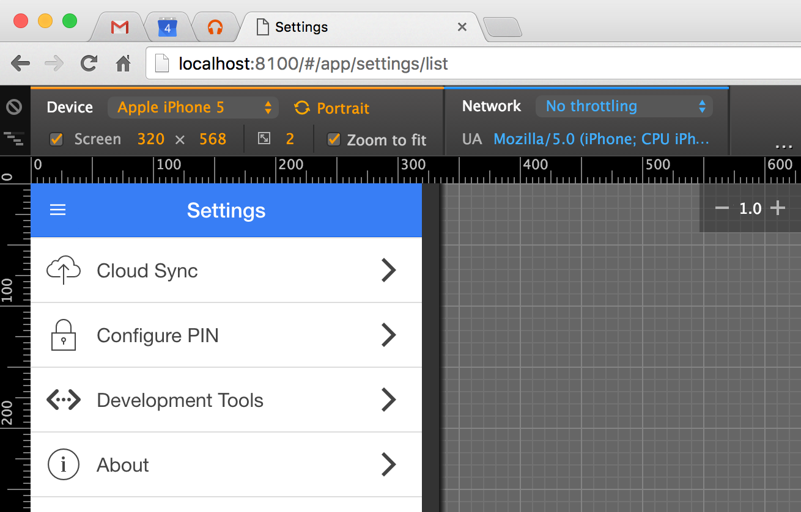
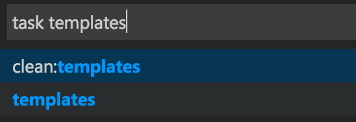
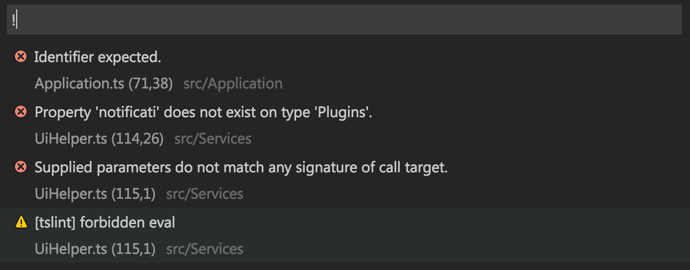

# Overview

This section contains a list of tips and suggestions I've found useful when building mobile apps with this sample project.

# Developing with Chrome

Chrome offers excellent support for debugging TypeScript and working with mobile applications. The developer tools provide user agent string spoofing, view port emulation, network speed throttling, and more.

Ionic offers the `ionic serve` command, which starts a lightweight HTTP server and serves your application.

With these two features combined, you can rapidly build out your application without lengthy native compilation or emulator startup times.



## Security Flags

When making HTTP requests to your backend API during development, you may find it useful to disable several security features, such as the same origin policy and SSL certificate checking. To do so, you can start Chrome using the following flags:

```
# OS X
$ open -a "Google Chrome.app" --ignore-certificate-errors --disable-web-security

# Windows
> chrome.exe --ignore-certificate-errors --disable-web-security
```

Since these flags disable important security features, it is important that you do not use this Chrome instance for normal web browsing. If you use Chrome as your primary browser, I recommend launching a second instance pointed at a development-only profile:

```
# OS X
$ open -a "Google Chrome.app" --ignore-certificate-errors --disable-web-security --user-data-dir=/tmp/ChromeDev

# Windows
> chrome.exe --ignore-certificate-errors --disable-web-security --user-data-dir=C:\tmp\ChromeDev
```

I went a step further and created an AppleScript that allows me to interactively start a new Chrome instance based on a series of dialog prompts to enable optional features like proxies. You can read more [here](http://www.justin-credible.net/2016/01/06/running-a-second-instance-of-chrome-for-development/), or look at the script directly [here](https://gist.github.com/Justin-Credible/0aa884c3a92a436db7d8).

## Mock Platform APIs

When running your application in Chrome, you will be unable to call Cordova plugins that do not provide a browser platform implementation.

In this case, you'll need to mock up the plugin's API interface via `src/Framework/MockPlatformApis.ts`.

The pattern I follow is to have all plugin access go through the `Plugins` service. This service exposes a property for each plugin. The property accessor should check to see if the plugin is available, and if it isn't, delegate to a mock implementation.

Your mock implementation can simply be a no-op, or you can write a simple polyfill to provide basic funtionality for testing.

You'll see that the sample project uses the Cordova notification plugin to display native alert and confirm dialogs while running on devices. While running in a browser, however, a mock implementation is provided that delegates to Ionic's `$ionicPopup` service.

## Mock HTTP APIs

During development, you may find it useful to mock up the responses for HTTP requests. This can be useful to test edge cases in your application, or even to build an application against APIs that aren't yet live.

You can mock up HTTP responses in `src/Framework/MockHttpApis.ts`. First, you specify the regular expression to match against a request URL, and then you provide a method that returns the data for that request.

When mock HTTP API mode is enabled (via the [in-app developer tools](base-framework.md#developer-tools)), these requests will not go over the wire, and will instead return your mocked-up data. There is a randomized delay of between one to three seconds so you can simulate the latency of a request on a cellular network.

# Running Natively

To run your application on the iOS Simulator or Android emulator, you can use the `ionic emulate ios` or `ionic emulate android` commands, respectively.

Likewise, to run on an attached device, you can use the `ionic run ios --device` or `ionic run android --device` commands.

It is important to remember that part of what Cordova does for you is generate the native projects in the platforms directory. These native projects can be opened in XCode and Android Studio. This is useful for debugging native code plugins. To update the generated projects, you can run `ionic prepare ios` or `ionic prepare android`.

# Running iOS Simulator Remotely

If you are developing your application on a Windows or Linux machine, but want to test and run your application on iOS, you can do so using the `gulp remote-emulate-ios` task to target a remote OS X machine.

First, you'll need to install the `remotebuild` package via npm on the OS X machine you want to use to build the project and run the simulator. Note that since the Cordova project will be built on the OS X machine, you must make sure you have all the build prerequisites installed as well (Xcode, etc.).

```
$ npm install -g remotebuild
$ remotebuild start
```

Next, you'll edit `remote-build.json`, located in the root of the starter project. This file will let you set the host name, port, and URL to point at your OS X machine, as well as configure other settings.

Finally, execute `gulp remote-emulate-ios` from the root of the starter project. This will take care of compiling TypeScript, building a payload, and uploading it to the OS X machine so it can be built.

# Visual Studio Code

## Shortcuts

If you are usig VS Code, you can use <kbd>⌘ Command</kbd><kbd>⇧ Shift</kbd><kbd>B</kbd> to build the application. This will execute the `gulp ts` task.

Additionally, you can use <kbd>⌘ Command</kbd><kbd>⇧ Shift</kbd><kbd>R</kbd>, then begin typing the name of a gulp task to run.



## Tasks

The `.vscode/tasks.json` file contains configuration for the tasks you can launch, as well as definition for the problem matchers. A problem matcher allows you to define a regular expression that matches console output from a task, then use that information to display warnings or errors in VS Code's warning or error views.



# Build Schemes

A common requirement during development is the ability to create different builds of your application. For example, you may have a development build to be used by developers while writing code, a staging environment for QA staff to use to test changes, and a production environment for live users.

In each of these schemes, you may need to point at different API URLs, or use different Google Analytics accounts, for example.

This starter project offers a gulp task and XML configuration to make it easy to switch between environments.

## Configuration Task

The `gulp config` task is responsible for configuring the application for the default scheme. If a scheme name is provided via the scheme argument, that scheme's configuration will be used instead.

For example, to use a scheme named "staging":

`gulp config --scheme staging`

!!! note
	The `gulp ts` task first runs `gulp config`, so if you're using VS Code, pressing <kbd>⌘ Command</kbd><kbd>⇧ Shift</kbd><kbd>B</kbd> will result in the app being configured for the default scheme in addition to compiling TypeScript code.

## Scheme Definitions

Build schemes are defined in the `config.master.xml` as child nodes under the `schemes` node:

```
<schemes default="development">

  <scheme name="development" debug="true">
    <replacement target="API_URL" value="http://development.your-company.com/api"/>
    <replacement target="API_VERSION" value="v1"/>
  </scheme>

  <scheme name="staging" debug="true">
    <replacement target="API_URL" value="http://development.your-company.com/api"/>
    <replacement target="API_VERSION" value="v1"/>
  </scheme>

  <scheme name="production" debug="false">
    <replacement target="API_URL" value="http://www.your-company.com/api"/>
    <replacement target="API_VERSION" value="v1"/>
  </scheme>

</schemes>
```

The `default` attribute indicates the name of the scheme to use if one isn't provided when executing `gulp config` (or using the VS Code shortcut).

Each scheme has a `name` attribute and a `debug` attribute. The debug attribute sets the value of an arbitrary debug flag that is available at application runtime. This flag can be checked to perform different behavior based on the flag's value (e.g., `Utilities.isDebugMode`).

Under each scheme node are replacement nodes. The `value` attribute is the content that should be used to replace any occurances of the value of the `target` attribute. Replacements will occur in the files listed in the generated files section.

For example, using the "staging" scheme by running `gulp config --scheme staging` would replace the following configuration chunk from `config.master.xml`:

```
<preference name="apiUrl" value="${API_URL}"/>
<preference name="apiVersion" value="${API_VERSION}"/>
```

with the following output to `config.xml`:

```
<preference name="apiUrl" value="http://development.your-company.com/api"/>
<preference name="apiVersion" value="v1"/>
```

## Base Schemes

Some of your build schemes may have nearly identical configurations, save for a single value or two. For these cases you can create a base scheme that contains the common values, and a specific scheme that uses the base scheme.

For example, perhaps you have two schemes that both point at production, but one is for pre-release testing, in which you don't want analytics tracking enabled:

```
<scheme name="base">
  <replacement target="API_URL" value="http://app.company.com/api"/>
  <replacement target="API_VERSION" value="v1"/>
</scheme>

<scheme name="prerelease" debug="true" base-scheme="base">
  <replacement target="GoogleAnalyticsId" value=""/>
</scheme>

<scheme name="release" debug="false" base-scheme="base">
  <replacement target="GoogleAnalyticsId" value="1234567890"/>
</scheme>
```

## Generated Files

The `gulp config` task generates the following files:

* Cordova's `config.xml` (from `config.master.xml`)
* Starting page `www/index.html` (from `www/index.master.html`)
* Runtime variables at `src/js/build-vars.js`

Variable substitution will be automatically performed for the `config.xml` and `www/index.html` files based on the build scheme.

The `build-vars.js` file will contain information about the build, such as application name, version number, debug flag, and build timestamp. In addition, all of the `preference` elements' values from `config.xml` will be present in a properties collection. All of these values are available via the `Configuration` service.